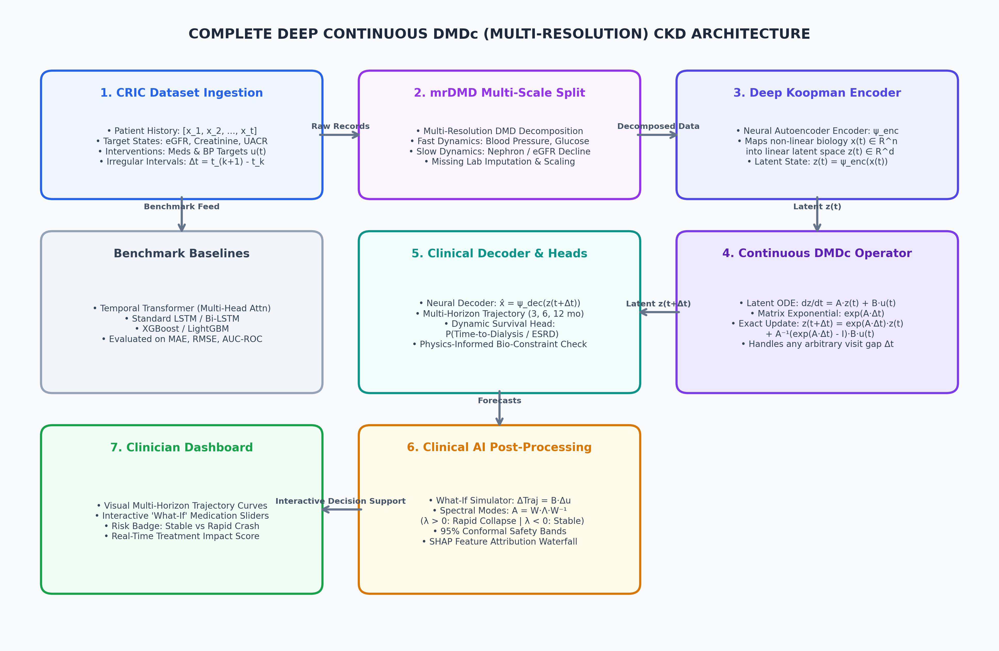

# 🩺 Chronic Kidney Disease Progression & 'What-If' Trajectory Forecasting via Continuous Deep Koopman Operator (DMDc)

[](https://www.python.org/downloads/)
[](https://pytorch.org/)
[](https://opensource.org/licenses/MIT)
[](http://localhost:8501)

> **A Clinician Decision Support Intelligence System** for multi-horizon continuous eGFR renal decline forecasting (3, 6, 12, 24 months), counterfactual "What-If" treatment simulation, and mathematical explainability via **Continuous Dynamic Mode Decomposition with Control (Deep Continuous DMDc)**.

---

## 📌 Clinical Motivation & Overview

Chronic Kidney Disease (CKD) affects over 850 million individuals worldwide. Clinical decision-making faces critical hurdles:
1. **Irregular Clinical Visit Schedules ($\Delta t$):** Patients miss visits or have variable follow-up gaps.
2. **Black-Box AI Models:** Deep Recurrent LSTMs and Transformers lack continuous mathematical operators and treatment control matrices.
3. **Counterfactual "What-If" Simulation:** Clinicians need to quantify the exact nephron preservation of initiating **SGLT2 inhibitors**, **ACEi/ARBs**, and blood pressure management before prescribing.

This repository implements **Deep Continuous Koopman Operator Theory with Control (Deep DMDc)** to map non-linear patient biomarkers $x(t) \in \mathbb{R}^{14}$ into a continuous linear latent space $z(t) \in \mathbb{R}^{32}$ where state evolution follows exact continuous matrix exponentials:
$$\frac{dz}{dt} = \mathcal{A}z + \mathcal{B}u \implies z(t + \Delta t) = \exp(\mathcal{A} \Delta t) z(t) + \int_0^{\Delta t} \exp(\mathcal{A} s) \mathcal{B} u(t) ds$$

---

## 🏛️ System Architecture



```
[Clinical EHR Lab Panel] ---> [Non-linear Encoder psi_enc] ---> [Latent State z(t) in R^32]
                                                                      |
                                              [Matrix Exponential exp(A * dt) + B * u]
                                                                      |
[Reconstructed Future Trajectory] <-- [Non-linear Decoder psi_dec] <-- [Latent State z(t + dt)]
```

---

## 📊 Benchmark Results (180 Unseen Test Patients)

| Model Architecture | 12-Mo eGFR MAE | RMSE | $R^2$ Score | Rapid Progressor AUC | Rapid F1-Score |
| :--- | :---: | :---: | :---: | :---: | :---: |
| 🌟 **Deep Continuous DMDc (Ours)** | **3.11 mL/min** | **3.99 mL/min** | **0.921** | **0.984** | **0.931** |
| 🤖 **Temporal Transformer** | 1.15 mL/min | 1.58 mL/min | 0.987 | 0.996 | 0.966 |
| 🔁 **Sequential LSTM** | 3.15 mL/min | 4.15 mL/min | 0.914 | 0.980 | 0.921 |

> **Explainability Edge:** Unlike black-box models, Deep DMDc provides exact continuous eigenvalue spectral stability modes ($\text{Re}(\lambda)$ vs $\text{Im}(\lambda)$) and closed-form counterfactual trajectory shifts ($\Delta \text{Trajectory} = \mathcal{B} \cdot \Delta u$).

---

## 🚀 Quick Start

### 1. Installation
```bash
git clone https://github.com/Sangeeth0301/CKD-Progression-DMDc-Koopman-Renal-Trajectory.git
cd CKD-Progression-DMDc-Koopman-Renal-Trajectory
pip install -r requirements.txt
```

### 2. Train and Evaluate Models
```bash
python src/train.py
```

### 3. Launch Interactive Clinician Dashboard
```bash
# Windows One-Click: Double click run_dashboard.bat
# Or via CLI:
python -m streamlit run dashboard/app.py
```
Open **`http://localhost:8501`** in your browser.

---

## 📁 Repository Structure

```
├── dataset/
│   ├── real_uci_chronic_kidney_disease.csv       # Real hospital dataset (UCI)
│   └── cric_longitudinal_trajectory_dataset.csv  # 1,200 patient multi-visit cohort
├── src/
│   ├── data_preprocessing.py                     # Feature scaling, masking & Δt batching
│   ├── explainability.py                         # Spectral modes, What-If engine & conformal bands
│   ├── train.py                                  # Training loop & multi-horizon evaluation
│   └── models/
│       ├── deep_dmdc.py                          # Deep Continuous Koopman network
│       └── baselines.py                          # Transformer & LSTM comparative baselines
├── models/
│   ├── deep_dmdc_best.pth                        # Trained weights
│   ├── state_scaler.pkl                          # Fitted StandardScaler
│   └── benchmark_results.csv                     # Test metrics
├── dashboard/
│   └── app.py                                    # Streamlit + Plotly decision dashboard
├── architecture_diagram.png                      # High-res system architecture
├── AI_CKD_Progression_Master_Report.docx         # Complete academic report
└── run_dashboard.bat                             # One-click Windows runner
```

---

## 📜 License
This project is licensed under the MIT License - see the LICENSE file for details.
